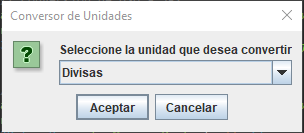

# Challenge-ONE-Back-End-src.main.java.com.challenge_one_backend_conversor.Conversor | Java | Back End | src.main.java.com.challenge_one_backend_conversor.Conversor de Moneda | Rolando Salinas

### ¡Bienvenido al proyecto src.main.java.com.challenge_one_backend_conversor.Conversor de Moneda con Java creado por Rolando Salinas! Pasos principales:
#### Marca este proyecto con una estrella ⭐
#### Sigue las lecciones y las instrucciones de contenido 📚
#### DETALLES DE ESTE CHALLENGE:
#### Contenidos importantes
Trello - Sprint 01
Discord exclusivo para estudantes de ONE
¡Es hora de comenzar el primer desafío con Java!

#### Tarjetas de Trello
Cada sprint del Challenge ONE - Java, pondremos a disposición un tablero en Trello que usarás como herramienta para gestionar el desarrollo de tu proyecto. Entonces, el primer paso será crear una cuenta de Trello. Luego, inicie sesión en esta cuenta y acceda al tablero del Sprint 01, disponible en:

<a href="https://trello.com/c/kHylhfEu/15-cuadro-de-di%C3%A1logo-men%C3%BA-principal">Trello Sprint 01</a>

Para usarlo, es necesario hacer una copia del tablero original. Para hacer esto, simplemente haz clic en Mostrar menú en la esquina superior derecha. Una vez hecho esto, haz clic en -> ... Más y luego -> Copiar tablero. Define el título del tablero que irá a tu perfil (Challenge ONE - Sprint 01, por ejemplo) y finalmente haz clic en el botón Crear.

#### Sugerencias de implementación, cursos y capacitación
Para este desafío, puedes usar el lenguaje Java y la lógica de programación. Algunos cursos de la plataforma pueden ayudarte, como:
<ul>
<li>Java JRE y JDK: compile y ejecute su primer programa</li>
<li>Java OO: Entendiendo la Orientación a Objetos</li>
<li>Java Polimorfismo: Entendiendo herencia e interfaces</li>
<li>Java Excepciones: Aprenda a crear, lanzar y controlar excepciones</li>
</ul>

#### Entrega de desafíos y creación de portafolios

Ahora puedes enviar tu proyecto y ganar una insignia exclusiva para este desafío siguiendo los siguientes pasos:
<ol>
<li>Publica tu proyecto en GitHub</li>
<li>Agregua el hashtag: "challengeoneconversorlatam5"</li>
</ol>

Puedes visualizar tu proyecto y los proyectos de tus compañeros accediendo a Repositorio base - src.main.java.com.challenge_one_backend_conversor.Conversor de Moneda y haciendo clic en el tema challengeoneconversorlatam5 en la pestaña "Acerca de" o "About" en el menú lateral de GitHub.

Completa el formulario de envío con el link de tu repositório de GitHub Link al formulario
Imagen del Formulario
Accede a tu correo electrónico y tendrás tu Insignia Exclusiva del Desafío

¡No olvides publicar un enlace o un video de tu proyecto en LinkedIn y etiquetar a Oracle!

Si aún no está familiarizado con Github, aquí hay algunos contenidos que pueden ayudarte:

Git y Github: que son y primeros pasos
Comenzando con Git: aprendiendo a versionar
¿Puedo subir mi proyecto a Github sin líneas de comando? - Git y Github para principiantes

### Presentacion del la aplicacion
